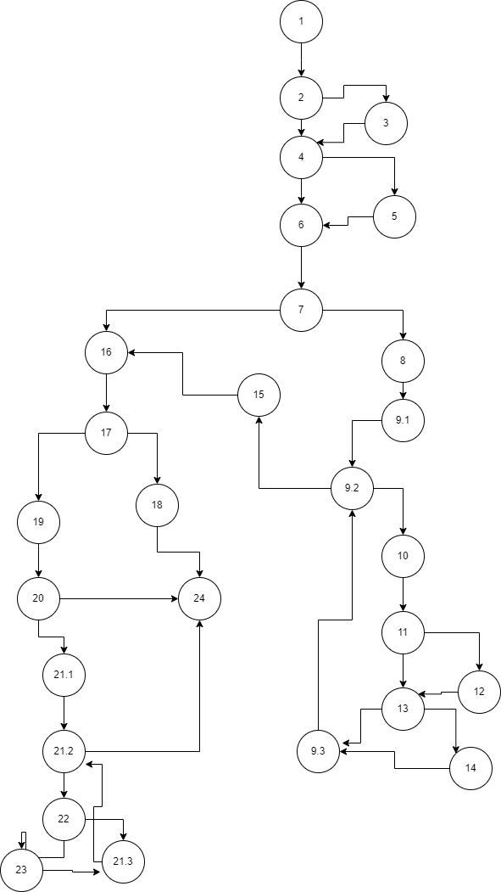

Martin Milosevski 203086

Цикломатска Комплексност

Цикломатска комплексност е 11, се добива со формулата E(врски)-N(јазли)+2,како што гледаме на сликата имаме 37врски и 28 јазли.Со тоа имаме 37-28+2=11